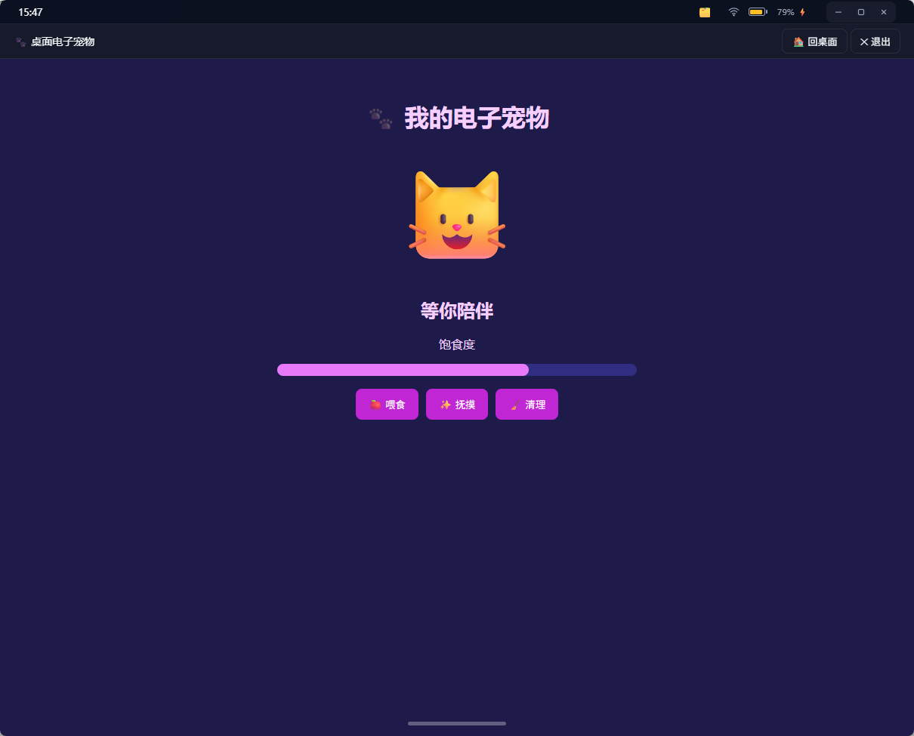
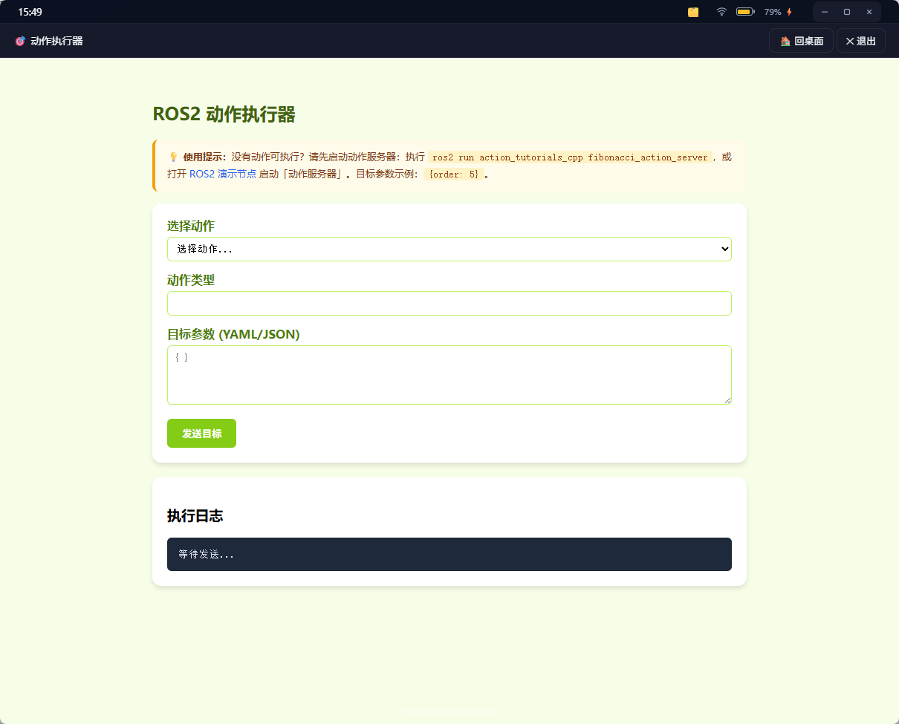
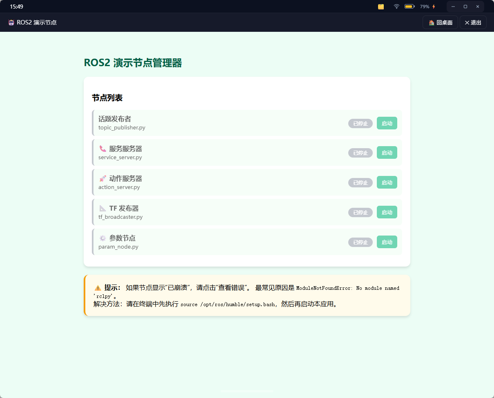

# 📦 Web Launcher Apps — 业务应用仓库

一个**纯应用仓库**项目：包含游戏、通用工具、ROS2 工具和 demo 应用，通过 web-launcher 框架运行。本项目**不含** launcher 框架代码本身。


## 🔗 相关仓库

- [GitHub：web-launcher-apps](https://github.com/Jun1172/web-launcher-apps)
- [Gitee：web-launcher（运行时）](https://gitee.com/jun626/web-launcher)
- [GitHub：web-launcher（运行时）](https://github.com/Jun1172/web-launcher)

两个代码托管平台内容保持同步，选择访问速度更快的平台即可。运行时、应用协议和发布工具的说明以 [web-launcher README](https://github.com/Jun1172/web-launcher#readme) 为准。

## 📌 项目定位

| 维度 | 说明 |
|------|------|
| **是什么** | 业务应用源码仓库（apps/）+ 发布工具（publish.py）+ 配置（config.json） |
| **不是什么** | 不含 launcher 框架（无 launcher.py / launcher/ 包）；运行需要先安装 web-launcher |
| **运行方式** | 将本项目的应用目录软链 / 复制到 web-launcher 的 `apps/` 下，再启动 web-launcher |
| **发布方式** | 本项目自带 `tools/publish.py`，按 `app.json` 递归发现应用并将 zip 推送到远端仓库 |
| **运行时发布** | launcher 自身的 OTA 包应在 web-launcher 项目中使用其 `tools/publish.py --launcher` 发布 |

## 📂 目录结构

```
web-launcher-apps/
├── README.md                # 本文档
├── config.json              # 仓库配置（host/port/repo/ports/system_apps）
├── tools/                    # 开发/维护工具（全部收进 tools/，根目录保持干净）
│   ├── publish.py            # 发布工具（与 web-launcher/tools/publish.py 同步）
│   ├── make_wheels.py        # 重建本仓库 wheels
│   ├── bootstrap.bat         # 一键重建本仓库 wheels
│   └── kill.bat              # 清理 python 进程
└── apps/
    ├── README.md            # 应用开发指南（与 web-launcher 同步）
    ├── game/                # 小游戏（11 个）
    ├── general/             # 通用工具（网络、文件、调试、日志等）
    ├── ros/                 # ROS2 工具（9 个）
    └── user/                # demo 应用（8 个）
```

## 🎯 内置应用

### 应用分组

| 分组 | 内容 | 环境要求 |
|------|------|----------|
| `game` | breakout、flappy-bird、snake、tetris、link-match 等小游戏 | 浏览器 |
| `general` | 文件、日志、Markdown、网络、TCP/UDP/MQTT 等工具 | 依应用而定 |
| `ros` | ROS2 action、bag、monitor、topic、teleop 等工具 | 目标机需安装并配置 ROS2 |
| `user` | hello、weather、game2048、system-monitor、cpp-hello 等示例 | C++ 示例需本机编译 |

完整应用清单以各目录中的 `app.json` 为准；发布脚本会递归扫描所有清单，不要求应用必须位于固定分组目录。

## 🚀 快速开始

### 方式 A：与 web-launcher 共置（推荐开发态）

```bash
# 1. 按需把本项目的应用分组软链到 web-launcher/apps/
# Windows（管理员权限）：
mklink /D c:\path\to\web-launcher\apps\general c:\path\to\web-launcher-apps\apps\general
# Linux：
ln -s /path/to/web-launcher-apps/apps/general /path/to/web-launcher/apps/general

# 2. 启动 web-launcher
cd ../web-launcher
python launcher.py
```

`game`、`general`、`ros`、`user` 都可以按同样方式接入。不要直接用整个 `apps/` 覆盖 launcher 的 `apps/`，否则可能覆盖系统应用；同名 `id` 也应只保留一个版本。

### 方式 B：复制 apps/ 到 web-launcher

```bash
# 复制一个应用分组
Copy-Item -Recurse apps/general ../web-launcher/apps/
```

## 📦 发布流程

```bash
# 列出所有可发布的应用
python tools/publish.py --list

# 发布单个通用应用
python tools/publish.py apps/general/calculator

# 发布整个 general 分组
python tools/publish.py --group general

# 发布所有 user demo
python tools/publish.py --user

# 一键发布全部
python tools/publish.py --all
```

ROS2 应用需要在已加载 ROS2 环境的终端中运行。`cpp-hello` 等原生应用需要先按应用目录中的说明完成本机编译，并针对目标平台分别生成产物。

## 📋 app.json Schema

详见 [web-launcher README - app.json Schema](https://github.com/Jun1172/web-launcher#-appjson-schema) 与 [apps/README.md](apps/README.md)。

通用应用清单示例：

```json
{
  "id": "calculator",
  "name": "计算器",
  "icon": "🧮",
  "color": "#3498db",
  "version": "1.0.0",
  "port": 8140,
  "cmd": ["apps/general/calculator/app.py"],
  "group": "general"
}
```

## 🧰 打开统一工具箱

本仓库根目录有一个 **`toolbox.bat`**，双击即可打开「统一工具箱」桌面窗口——它同时管理 web-launcher 与本仓库的所有开发 / 发布 / 重建脚本（运行、打包、发布、重建、清理），带中文说明、点一下就能跑。

> 工具箱本体只有一个，放在 web-launcher 仓库（`web-launcher/tools/toolbox.py`）；本仓库的 `toolbox.bat` 只是便捷入口。需保证两个仓库在同一目录下（`exe\web-launcher` 与 `exe\web-launcher-apps` 同级）。

## 🔧 本仓库的重建脚本

本仓库作为独立项目，自带产物重建脚本（与 web-launcher 互不越界）：

- `tools/make_wheels.py`：扫描**本仓库**各 `app.json` 的 `deps`，下载依赖 wheels 到本仓库 `wheels/<平台>/`。Python 版本号自动探测同级 `web-launcher/runtime`（找不到时回退 3.11）。
- `tools/bootstrap.bat`：一键重建本仓库 wheels（runtime 属于 web-launcher，请到它那里重建）。

## 🔧 开发提示

- 应用启动、端口探测、安装/卸载、版本回退和 `app.json` 字段行为见 [web-launcher README](https://github.com/Jun1172/web-launcher#-appjson-schema)。
- 应用目录中的 README 优先说明该应用的额外依赖和启动方式。
- 两个仓库都保留部分 demo 是为了方便独立开发；接入 launcher 时应按需选择目录，避免同名应用同时存在。

## 🔧 部分应用演示






## 📜 License

MIT
