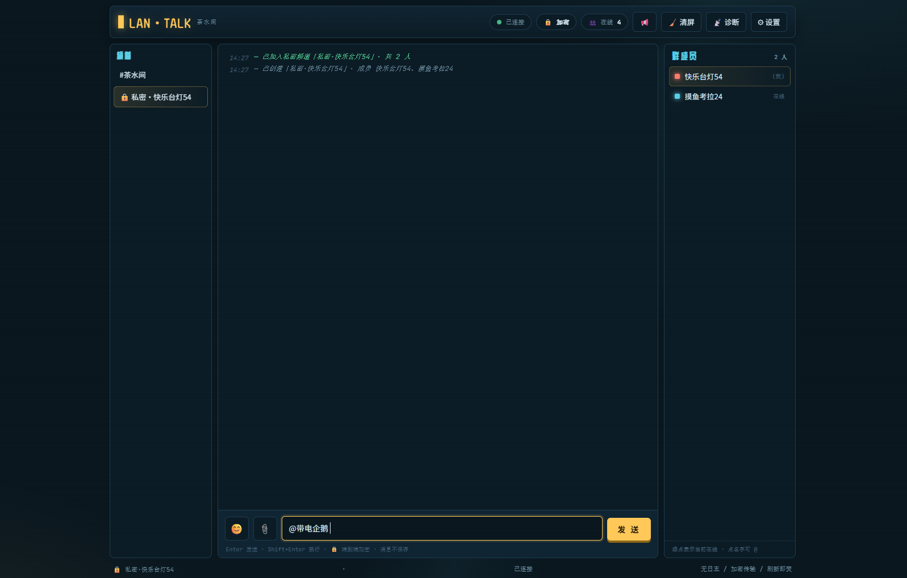

# LAN·TALK — 茶水间

> 一个基于 MQTT WebSocket 的轻量级局域网加密聊天室。  
> 支持端到端加密、无日志、刷新即焚、私密群组与桌面通知。

---

## 简介

**LAN·TALK 茶水间** 是一个单文件、可直接部署的网页聊天工具。

它通过 MQTT over WebSocket 实现实时消息通信，所有消息在浏览器端进行 AES 加密，只有拥有相同加密口令的用户才能解密并查看消息内容。

适合用于：

- 局域网内部沟通；
- 团队临时交流；
- 内网加密聊天；
- 私有部署的轻量即时通讯；
- 不想依赖第三方聊天服务的场景。

---

## 特性

### 🔒 端到端加密

消息内容使用 AES 加密处理，加密口令相同的人才能解密消息。

- 消息在浏览器端完成加密与解密；
- 频道口令即解密密钥来源；
- 保存配置后会重新派生密钥；
- 适合内部私密沟通场景。

### 🧹 刷新即焚

页面不会持久化保存聊天记录。

- 刷新页面后消息即清空；
- 不主动写入本地聊天记录；
- 适合临时交流、敏感信息讨论、茶水间闲聊等场景。

> 注意：刷新即焚指的是本页面不保存消息，但不阻止接收方截屏、复制或其他形式的留存。

### 📡 MQTT WebSocket 实时通信

项目基于 MQTT over WebSocket 实现消息收发。

- 支持配置 MQTT WebSocket 地址；
- 支持自定义频道；
- 支持在线状态与在线名单；
- 支持连接诊断。

### 👥 私密加密群组

除了公共频道外，还可以创建私密群组。

- 在在线名单中勾选用户；
- 创建私密群；
- 向指定用户发送加密邀请；
- 被邀请者可凭口令加入。

### 📢 桌面通知与未读提示

- 支持浏览器桌面通知；
- 支持标题栏未读消息提示；
- 切换窗口后也能感知新消息。

### 🧪 内置连接诊断

提供连接诊断功能，可帮助排查：

- MQTT WebSocket 地址是否正确；
- 是否能连接 Broker；
- 加密口令是否配置；
- 频道是否正常接入；
- 网络与协议是否可用。

---

## 快速开始

如果只是一个简单测试，可以直接双击打开 `index.html`。
注意更换自己的服务器地址