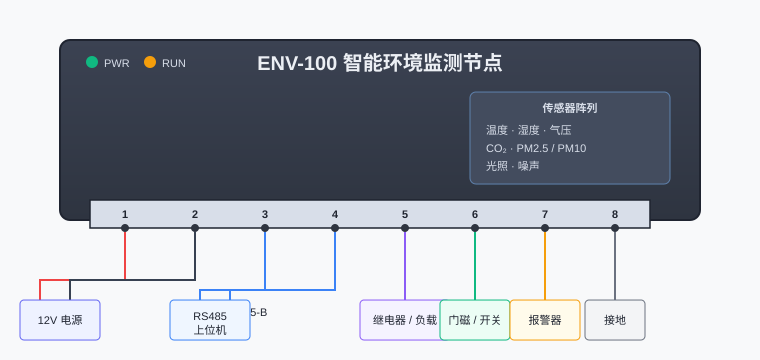

# ENV-100 智能环境监测节点 · 设备手册

> **版本**：v2.3.1 ｜ 适用固件 ≥ 2.0.0 ｜ 最后更新：2026-08 ｜ 文档编号：DOC-ENV100-231

## 简介

ENV-100 是一款面向工业现场的多功能环境监测节点，集成温湿度、大气压、CO₂、PM2.5/PM10、光照与噪声七项传感器，支持 Modbus-RTU、MQTT、HTTP 三种上报方式，可独立离线运行，也可接入上位机系统。

本手册供现场调试工程师与集成人员使用，涵盖接线、配置、API 调用与维护注意事项。

## 功能特性

- **多传感器融合**：温湿度 / 气压 / CO₂ / 颗粒物 / 光照 / 噪声，单节点全覆盖
- **离线运行**：内置 8MB 存储，断网本地缓存 7 天数据，恢复后自动补传
- **多协议上报**：同时支持 Modbus-RTU（RS485）、MQTT、HTTP POST
- **低功耗**：休眠模式 < 3mA，适合电池供电场景
- **工业级防护**：IP65 外壳，-20℃ ~ +60℃ 工作温度
- **远程升级**：OTA 固件升级，支持回滚

## 接线说明

设备底部为 8 位可插拔端子，引脚定义如下：

| 端子 | 信号 | 方向 | 说明 |
| :--: | :-- | :--: | :-- |
| 1 | VCC | IN | 直流供电 9–24V，建议 12V |
| 2 | GND | — | 电源地，与信号地共地 |
| 3 | RS485-A | I/O | Modbus-RTU 差分正 |
| 4 | RS485-B | I/O | Modbus-RTU 差分负 |
| 5 | DO-1 | OUT | 数字输出 1，开漏 30V/100mA |
| 6 | DI-1 | IN | 数字输入 1，支持干接点 |
| 7 | ALARM | OUT | 故障报警输出，低电平有效 |
| 8 | SHIELD | — | 屏蔽层接地端子 |

接线示意图：



> 提示：RS485 总线末端节点建议并联 120Ω 终端电阻；多节点组网时总线长度不超过 1000 米。

## 配置流程

1. 接通 12V 电源，**PWR** 指示灯常亮
2. 等待 **RUN** 指示灯以 1Hz 闪烁（约 3 秒），表示进入工作态
3. 通过 USB-C 配置口连接电脑（虚拟串口，115200 8N1），或使用 Modbus 写寄存器配置
4. 配置上报地址、采集间隔、报警阈值
5. 保存配置后自动重启生效

## API 文档

设备默认通过 HTTP 上报到配置的服务器，接口约定如下：

### 上行：数据上报

`POST /api/v1/devices/{device_id}/data`

请求体（JSON）：

```json
{
  "device_id": "ENV100-A0B1C2",
  "timestamp": 1724236800,
  "uptime_s": 86400,
  "sensors": {
    "temperature_c": 26.4,
    "humidity_pct": 58.2,
    "pressure_hpa": 1013.1,
    "co2_ppm": 612,
    "pm25_ugm3": 18,
    "pm10_ugm3": 35,
    "lux": 320,
    "noise_db": 42.5
  },
  "alarms": []
}
```

响应：`200 OK`

```json
{ "status": "ok", "server_time": 1724236801 }
```

### 下行：Modbus 寄存器

常用保持寄存器（功能码 0x03 读 / 0x10 写）：

```text
地址   名称              类型     读写  说明
0x0001 采集间隔          uint16   RW   单位秒，范围 5–3600
0x0002 上报模式          uint16   RW   0=关闭 1=MQTT 2=HTTP 3=Modbus
0x0003 温度校准          int16    RW   单位 0.1℃，范围 -50~50
0x0010 实时温度          int16    RO   单位 0.1℃
0x0011 实时湿度          uint16   RO   单位 0.1%
0x0012 实时CO2           uint16   RO   单位 ppm
0x0100 固件版本          uint16   RO   BCD 编码，如 0x0203 = v2.3
0x0101 重启命令          uint16   WO   写 0xA55A 触发软重启
```

读寄存器示例（Python）：

```python
import struct

# 读取 0x0010 起的 3 个寄存器（温度/湿度/CO2）
resp = modbus_client.read_holding_registers(address=0x0010, count=3)
temp, hum, co2 = struct.unpack('>hhH', resp.encode())
print(f"温度 {temp/10:.1f}℃  湿度 {hum/10:.1f}%  CO2 {co2}ppm")
```

## 注意事项

- **供电**：禁止超过 24V，反接保护仅覆盖瞬态，长时间反接会损坏设备
- **RS485**：A/B 不可接反；现场干扰大时务必使用屏蔽双绞线，屏蔽层接端子 8
- **传感器寿命**：CO₂ 与颗粒物传感器预期寿命 5 年，到期需返厂校准
- **存储**：固件升级前请确认本地缓存已补传完毕，升级会清空待发队列
- **IP65**：外壳防护针对淋雨，不浸水；端子插拔时务必先断电
- **固件**：仅可使用官方签名固件，刷入第三方固件将失去保修

---

如需更多协议细节，请参阅 `docs/protocol/` 目录下的补充说明。
