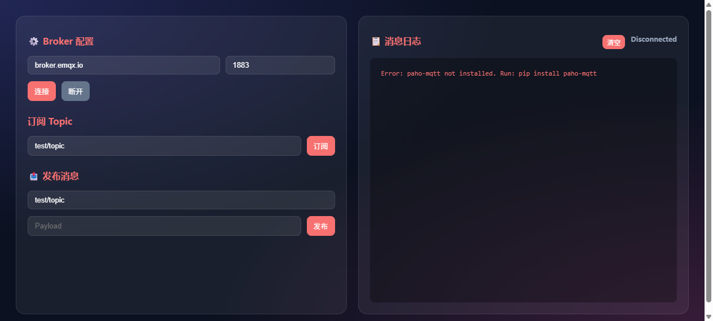

# 🌐 MQTT 调试助手（mqtt-debug）

验证 Launcher 对依赖第三方 Python 库 (`paho-mqtt`) 应用的支持，以及 MQTT 协议订阅/发布流程。

## 应用行为
- 启动时检查 `paho-mqtt` 是否安装，未安装则在 UI 提示安装命令
- 提供 Web UI 连接 MQTT Broker，支持订阅 Topic 和发布 Payload
- 后台线程通过 `paho.mqtt.client.loop_start()` 维持 MQTT 长连接
- 实时记录连接状态 (SYS)、订阅消息 (RX) 和发布消息 (TX)

## 验证什么
| 能力 | 实际行为 |
| --- | --- |
| 第三方依赖管理 | 若未安装 `paho-mqtt`，UI 明确提示 `pip install paho-mqtt`，不崩溃 |
| MQTT 长连接 | 连接公共 Broker (如 `broker.emqx.io`) 后，状态栏显示 `Connected` |
| 异步消息处理 | 订阅 Topic 后，其他客户端发布的消息能实时推送到 UI，无轮询延迟 |
| 优雅断开 | 点击「断开」或关闭应用时，MQTT 客户端正确调用 `disconnect()`，不产生僵尸连接 |

## 适用场景
- 物联网 (IoT) MQTT 协议调试
- 智能家居设备消息抓包
- 验证 Launcher 对 `pip` 依赖应用的兼容性与错误提示机制

## 验证步骤
1. 确保已安装依赖：`pip install paho-mqtt`。
2. 在 Launcher 中点击 🌐 MQTT 调试助手。
3. Broker 配置保持默认 (`broker.emqx.io:1883`)，点击「连接」。状态变为 `Connected`。
4. 在「订阅 Topic」输入 `test/topic`，点击「订阅」。
5. 在「发布消息」输入相同 Topic 和 Payload，点击「发布」。
6. 观察日志区域是否同时出现黄色的 `[TX]` 和绿色的 `[RX]` 记录。

## 文件
- `app.json` —— 应用清单（端口 8144，包含 `PIP_REQUIRE` 提示）
- `app.py` —— MQTT 客户端逻辑 + 状态管理 + 前端 UI