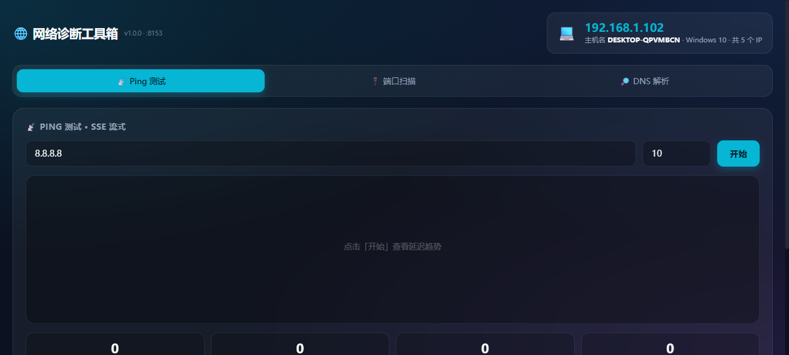

# 🌐 网络诊断工具箱 (net-diag)



离线可用的本地网络诊断工具，深色科技风 UI，纯手绘 Canvas 折线图，无需任何 CDN。

## 功能

- **Ping 测试**：SSE 流式返回每次结果，Canvas 实时绘制延迟折线图，统计平均/最小/最大/丢包率。
  - 跨平台：优先调用系统 `ping` 命令（兼容 Windows 中文/英文 与 Linux 输出格式，正则提取 `time=`）；系统 ping 不可用时自动回退到 TCP 连接 80/443 端口测 RTT。
- **端口扫描 (TCPing)**：`socket.create_connection` 探测端口连通性，返回开放/关闭与延迟。
- **DNS 解析**：`socket.getaddrinfo` 解析 A 记录列表。
- **本机信息**：显示主机名、本机 IP 等。

## 端口

默认 `8153`（可由环境变量 `LAUNCHER_APP_PORT` 覆盖）。

## 路由

| 路由 | 说明 |
| --- | --- |
| `GET /` | 内嵌 HTML 首页 |
| `GET /api/ping?host=xxx&count=10` | SSE 流式返回每次 ping 结果 |
| `GET /api/tcping?host=xxx&ports=80,443,8080` | 端口连通性结果 |
| `GET /api/dns?domain=xxx` | DNS 解析结果 |
| `GET /api/whoami` | 本机 IP 信息 |

## 运行

```bash
python apps/general/net-diag/app.py
```
