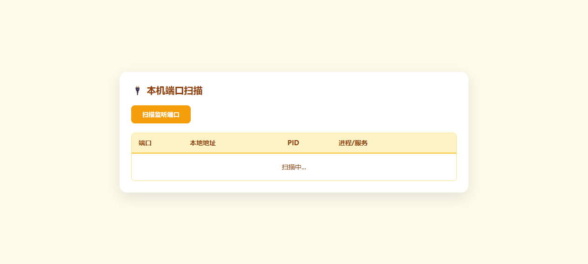

# 🔌 端口扫描 (port-scanner)

验证 Launcher 承载需要调用系统命令的后端应用的能力。
## 应用行为
调用系统 `netstat` (Windows) 或 `lsof` (Linux/Mac) 获取本机监听端口，并通过 `tasklist` 解析对应的进程名称。
## 验证步骤
1. 在 Launcher 中点击「端口扫描」。
2. 观察表头是否高亮显示，列表是否包含具体的进程名（如 `python.exe`、`chrome.exe`）。