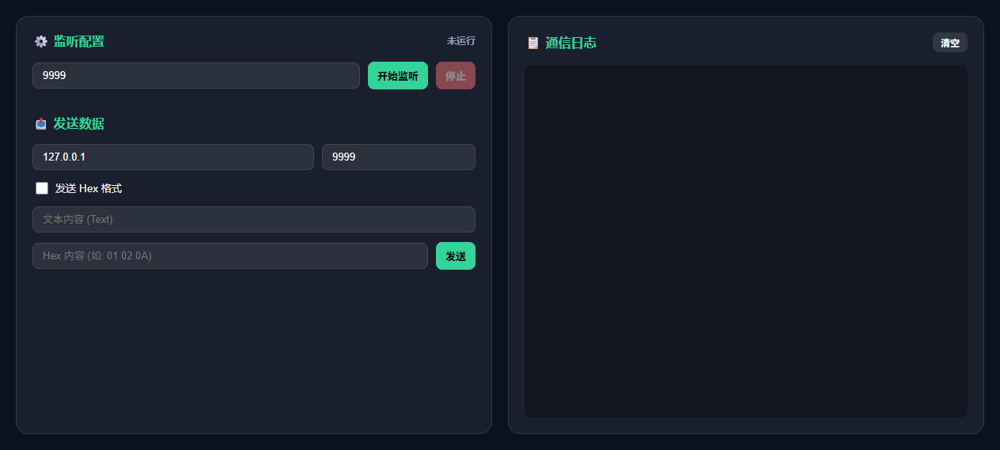

# 📡 UDP 调试助手（udp-debug）

验证 Launcher 管理网络调试类应用的能力，以及 Python 多线程 Socket 与 HTTP 服务的共存。

## 应用行为
- 启动后提供 Web UI 和 REST API (`/api/start`, `/api/send`, `/api/logs`)
- 支持 UDP Server 监听指定端口，接收数据并记录到内存日志队列
- 支持 UDP Client 向指定 IP:Port 发送文本或 Hex 数据
- 实时通信日志在 UI 上滚动显示，区分 RX (绿色) 和 TX (黄色)

## 验证什么
| 能力 | 实际行为 |
| --- | --- |
| UDP Server 监听 | 点击「开始监听」后，应用绑定指定端口，后台线程阻塞接收数据 |
| 数据格式解析 | 支持纯文本和 Hex 字符串发送，日志同时显示 Hex 和 UTF-8 文本 |
| 线程安全与并发 | 接收线程与 HTTP 请求线程共享日志队列，无阻塞、无崩溃 |
| 优雅清理 | 停止监听或关闭应用时，Socket 正确释放，端口不占用 |

## 适用场景
- 嵌入式设备 UDP 协议调试
- 局域网广播/组播数据抓包分析
- 验证 Launcher 对长驻后台线程应用的管理

## 验证步骤
1. 在 Launcher 中点击 📡 UDP 调试助手。
2. 在「监听配置」输入端口 `9999`，点击「开始监听」。
3. 使用系统终端执行：`echo "hello udp" | nc -u 127.0.0.1 9999` (Linux/Mac) 或使用其他 UDP 工具发送。
4. 观察日志区域是否出现绿色的 `[RX]` 记录。
5. 在「发送数据」区域输入目标 `127.0.0.1:9999` 和内容，点击发送，观察黄色的 `[TX]` 记录。

## 文件
- `app.json` —— 应用清单（端口 8148）
- `app.py` —— UDP 收发逻辑 + HTTP API + 前端 UI