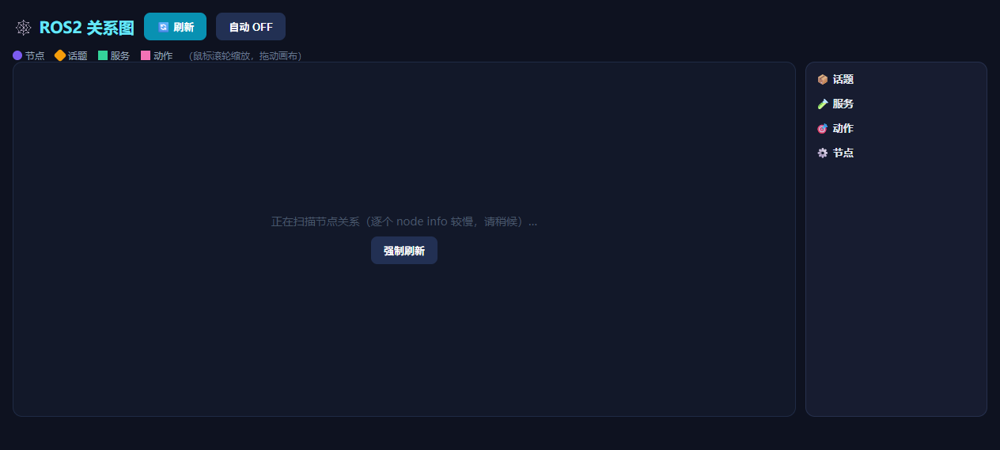

# 🕸️ 关系图（ros2-graph）

交互式 ROS2 节点关系图：可视化节点与话题 / 服务 / 动作的连接关系。

## 功能

- 自动发现 ROS2 系统中的节点与它们之间的连接
- 以节点关系图形式展示话题 / 服务 / 动作的连接
- 交互式浏览：缩放 / 拖拽节点

## 环境要求

- ROS2 Humble 或更高版本，且终端已 source ROS2 环境
- 无 ROS2 环境时应用仍可启动（显示空图）

## 说明

- 端口：8207（ros 组）
