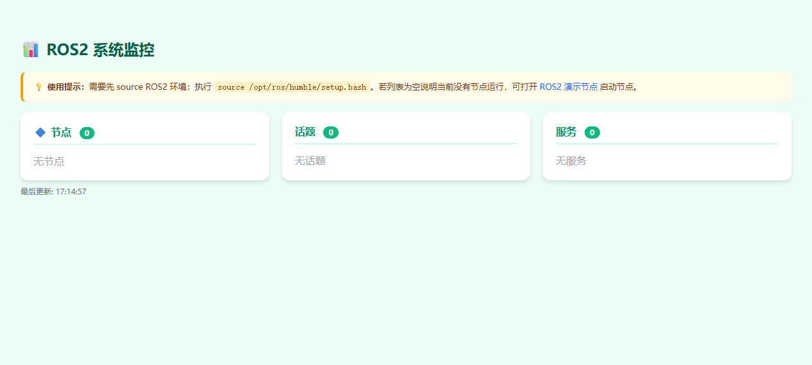

#  ROS2 监控 (ros2-monitor)

实时监控 ROS2 系统的节点、话题、服务状态。

## 应用行为
- 每 3 秒自动刷新 ROS2 系统状态
- 显示当前运行的所有节点、话题、服务
- 纯展示型应用，无需 ROS2 环境也能启动（显示空列表）

## 验证步骤
1. 启动 ROS2 环境：`source /opt/ros/humble/setup.bash`
2. 运行一些 ROS2 节点（如 `ros2 run demo_nodes_cpp talker`）
3. 在 Launcher 中点击「ROS2 监控」
4. 观察页面是否实时显示节点、话题列表

## 依赖
- ROS2 Humble 或更高版本
- 需要已 sourced ROS2 环境