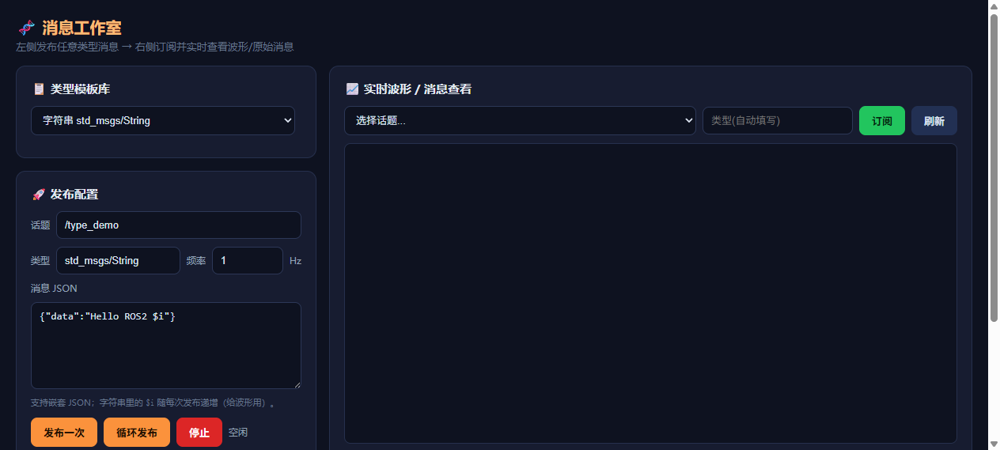

# 🧬 类型/波形（ros2-type-studio）

类型模板库 + 实时波形/消息查看器（合并版）：内置常用消息类型一键发布，自定义任意类型/JSON，下方即可订阅查看实时波形与原始消息。

## 功能

- 类型模板库：内置常用 ROS2 消息类型（std_msgs / sensor_msgs 等），一键发布
- 自定义类型 / JSON 发布
- 实时波形查看：订阅后以波形展示数值字段
- 原始消息查看：同时显示完整消息原文

## 环境要求

- ROS2 Humble 或更高版本，且终端已 source ROS2 环境
- 无 ROS2 环境时应用仍可启动（无数据）

## 说明

- 端口：8209（ros 组）
